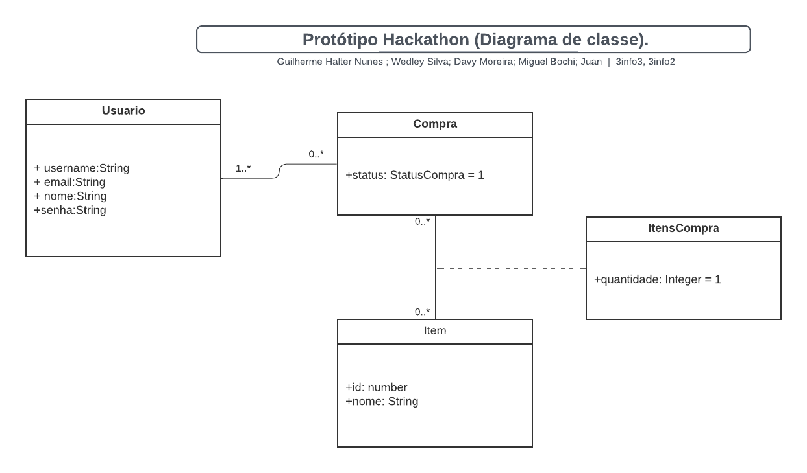

# Projeto Hackathon

### Tech-Titans-Hackathon

O projeto consiste no desenvolvimento e organização de sistemas Front-end e Back-end em uma maratona com cerca de 27 horas, com equipes disputando entre si a fim de prouzir o melhor projeto.
A prosposta estabelecida para o projeto é um Sitema de Controle Hackathon, elaborado com o objetivo de cumprir as exigências propostas como: Aparência das telas, funcionalidade dos sistemas, resolução de problemas, organização do grupo e apresentação.

Equipe:

- [Davy Moreira Sebolt](https://github.com/Rascro)
- [Gilherme Halter Nunes](https://github.com/GuilhermeHalter)
- [Miguel Bochi Barros](https://github.com/MiguelBochi)
- [Juan Petersson Borges Padilha](https://github.com/alujuan)
- [Wedley Silva Schmoeller](https://github.com/WedleySilva)


Links do projeto:

- [Documentação (esse documento)](https://github.com/Hackathon-Organization/Base-ProjetoHackathon)
- Backend: [Repositório](github.com/) e [Publicação](https://)
- Frontend: [Repositório](github.com/) e [Publicação](https://)

# Desenvolvimento do Projeto

(Nessa parte a equipe deve escolher um dos modelos de sistemas para desenvolver o projeto. Ao escolher, escreva uma breve descrição do sistema e o motivo da escolha e pode apagar os outros).

# Situação Problema

(Nessa parte a equipe deve descrever a situação problema que será resolvida pelo sistema).

Descrever o que acontece atualmente na empresa em um contexto global,
abordando o funcionamento da empresa como um todo, não apenas os “problemas” que lá ocorrem.

Sabendo disso, seu papel é **detalhar o funcionamento da empresa escolhida na
atualidade, ou seja, antes de seu novo software**, usando como base a situação que passamos, mas aprofundando os detalhes de como as coisas acontecem.

- Pesquise sobre empresas do ramo escolhido
  para entender como funcionam;
- Aproveite seus conhecimentos previamente adquiridos na área da empresa que escolheu, se houver;
- Simule uma situação real. Lembre-se que são propostas com empresas fictícias, sendo assim, você terá que tomar certas decisões sobre como a empresa funciona em relação às coisas que não estão definidas no documento base (por exemplo, no caso da padaria, dizemos que seu Genival contratou mais funcionários, mas saber quantos e o que fazem pode ser relevante para o software), então tente “visualizar” a empresa funcionando, como se você estivesse lá acompanhando o dia-a-dia;

**BASE DE COMO MONTAR O TEXTO**

- **Introdução**: comece com um parágrafo apresentando a empresa (nome, o que faz, tempo de existência, o dono, funcionários, etc);
- **Situação-problema**: Aborde em detalhes como a empresa funciona, procurando seguir uma ordem lógica dos acontecimentos e organizando parágrafos diferentes para cada coisa diferente que for explicar (como faria em uma redação);
- **Conclusão**: tenha um parágrafo de conclusão focando nos problemas que você notou dentro da situação problema analisada e aponte brevemente como um software poderia ajudar a resolvê-los.

# Descrição da Proposta

**Alguns pontos importantes a se destacar são:**

- **Qual o foco de ação do software** relacionado com os problemas levantados na análise da situação-problema. O que realmente o software vai fazer. Por exemplo, o foco de ação do Gmail é permitir o envio e recebimento de e-mails.

- **Os níveis de usuário do sistema.** Somente o gestor tem acesso? E os funcionários? Talvez seja para ambos, ou para funcionários de cargos diferentes, etc.

- **O que poderá ser feito no software**.Apenas o principal, sem pensar em telas ou detalhes específicos, pois isso será feito em outro momento.

- **Se houver mais de um nível de usuário**, ressaltar as diferenças entre eles na descrição da proposta.

# Regras de negócio

As Regras de Negócio são orientações e restrições que ajudam a regular as operações de uma empresa. Dentro desses processos, existem regras que devem ser seguidas durante a execução das atividades, que ajudam a definir COMO as operações devem ser realizadas e gerenciadas, POR QUEM, QUANDO, ONDE e POR QUÊ.

**Como escrever regras de negócio?**

- Número identificador.
- Nome da regra.
- Data de criação e data da última alteração para comparações e controle.
- Nome dos Autores das versões.
- Número da versão (1, 2 etc).
- Dependências: insira o identificador das regras atreladas, às quais a regra em questão depende.
- Uma descrição detalhada para compreensão da regra.

**Exemplos de regras de negócio com formatação**

Regras de negocio realizadas por [Aluno 1]; [Aluno 2]...
feito em dd/mm/nnnn às 16:34 horas

**RN01 – Criação Comanda:** Para iniciar um atendimento no balcão, é necessário primeiro abrir uma nova comanda.

**RN02 – Inserir Produtos Comanda:** Para inserir um produto na comanda, é necessário que o produto esteja cadastrado no sistema e que a quantia comprada seja acima de zero.

**RN03 – Cadastro de Leitores:** Os leitores precisam fazer o cadastro para realizar o empréstimo.

**RN04 – Realizar Empréstimo:** Para realizar o empréstimo, apenas leitores com cadastro e nenhuma multa em aberto.

# Requisitos funcionais

Um requisito funcional é uma declaração de como um sistema deve se comportar. Define o que o sistema deve fazer para atender às necessidades ou expectativas do usuário.

Os requisitos funcionais são compostos de duas partes: **função** e **comportamento**.

A **função** é o que o sistema faz. Por exemplo: “calcular imposto sobre vendas”.

O **comportamento** é como o sistema faz. Por exemplo: “O sistema deve calcular o imposto sobre vendas multiplicando o preço de compra pela alíquota do imposto.”.

**Tipos de requisitos funcionais.**

Os requisitos funcionais podem ser classificados em:

- Regulamentos de Negócios
- Requisitos de Certificação
- Requisitos de relatório
- Funções Administrativas
- Níveis de autorização
- Rastreamento de auditoria
- Interfaces Externas
- Gestão de dados
- Requisitos Legais e Regulamentares

**Diretrizes para a elaboração de requisitos funcionais.**

Cada requisito funcional precisa ser:

**Específico** sobre o que o sistema deve fazer.
**Mensurável** para que você possa dizer se o sistema está fazendo isso
**Alcançável** dentro do prazo que você definiu
**Relevante** para seus objetivos de negócios
**Limitado** no tempo para que você possa acompanhar o progresso

Um requisito funcional deve ser estruturado da seguinte forma:

- **Número do requisito funcional:** RF001; RF002
- **Nome do requisito funcional:** descrição do requisito.

  - **Dados necessários:** dado 1, dado 2, dado 3.

  - **Usuários:** todos os níveis de usuário.

# Requisitos não funcionais

Os Requisitos Não Funcionais explicam as limitações e restrições do sistema a ser projetado. Esses requisitos **não têm nenhum impacto na funcionalidade do aplicativo**. Além disso, existe uma prática comum de subclassificar os requisitos não funcionais em várias categorias:

- Interface de Usuário
- Confiabilidade
- Segurança
- Atuação
- Manutenção

Aqui estão alguns exemplos de requisitos não funcionais:

- **Segurança**: O sistema deve ser protegido contra acesso não autorizado.
- **Atuação**: O sistema deve ser capaz de lidar com o número necessário de usuários sem qualquer degradação no desempenho.
- **Escalabilidade**: O sistema deve ser capaz de aumentar ou diminuir conforme necessário.
- **Disponibilidade**: O sistema deve estar disponível quando necessário.
- **Manutenção**: O sistema deve ser fácil de manter e atualizar.
- **Portabilidade**: O sistema deve ser capaz de rodar em diferentes plataformas com alterações mínimas.
- **Confiabilidade**: O sistema deve ser confiável e atender aos requisitos do usuário.
- **Usabilidade**: O sistema deve ser fácil de usar e entender.
- **Compatibilidade**: O sistema deve ser compatível com outros sistemas.
- **Conformidade**: O sistema deve cumprir todas as leis e regulamentos aplicáveis.

(A seguir, um exemplo de organização de requisitos não funcionais.)

Requisitos não funcionais:

R.N.F. 01 - Nome do requisito não funcional: descrição do requisito.

R.N.F. 02 - Nome do requisito não funcional: descrição do requisito.

# Diagrama de Caso de Uso

O diagrama de caso de uso é uma ferramenta de modelagem que descreve o comportamento de um sistema a partir da perspectiva do usuário. Ele é usado para capturar os requisitos funcionais de um sistema.

- Especificam a visão externa do sistema.
- Descrevem como o sistema é percebido por seus usuários.
- Descrevem as interações entre os usuários e o sistema.

**Os casos de uso:**

- Descrevem como os usuários interagem com o sistema (as funcionalidades do sistema)
- Facilitam a organização dos requisitos de um sistema.
- Dão uma visão externa do sistema
  -O conjunto de casos de uso deve ser capaz de comunicar a funcionalidade e o comportamento do sistema para o cliente.
- Descrevem o que o sistema faz, mas não especificam como isso deve ser feito.

# Diagrama de Classe



# Sobre o Projetos

O (nome do projeto) contém três projetos diferentes:

1. `nome da pasta React`: Um projeto front-end em React Native.
2. `nome da pasta Vue`: Um projeto front-end em Vue.js.
3. `nome da pasta Django`: Um projeto back-end em Django REST framework (DRF) com PDM.

# Padronização de Commits

Este projeto segue os devidos padrões de Commit:

```bash
    <tipo>(<escopo>): <mensagem>
```

- Onde:

  - **tipo**: descreve a natureza do commit (por exemplo, feat para uma nova funcionalidade, fix para correção de bugs, docs para documentação e create para criação de projeto).
  - **escopo**: opcional, refere-se à parte do projeto afetada pela mudança.
  - **mensagem**: é uma descrição concisa e clara da alteração.

- Alguns exemplos de padronização dos commits:

  **Criando projeto:**

```bash
    git commit -m "create(main): criação do projeto"
```

  **Adicionando uma nova funcionalidade:**

```bash
    git commit -m "feat(auth): adiciona autenticação de usuário"
```

**Corrigindo um bug:**

```bash
    git commit -m "fix(nav): corrige problema de navegação no menu"
```

**Atualizando a documentação:**

```bash
    git commit -m "docs(readme): atualiza instruções de instalação"
```

**Refatorando código:**

```bash
    git commit -m "refactor(utils): otimiza função de manipulação de strings"
```

# Comandos Úteis e Plugins

**Comandos Vue:**

- Tutoriais: [Vue Aula eduardo](https://eduardo-da-silva.github.io/aula-desenvolvimento-web/intro/criar-aplicacao-vuejs.html)
- Criar o projeto: "npm init vue@latest ."
- Instalar dependências:"npm install"
-Rodar o Projeto:"npm run dev"

**Comandos React:**

- Tutoriais: [React Aula eduardo](https://eduardo-da-silva.github.io/aula-desenvolvimento-mobile/)
- Criar o projeto: "npx create-expo-app Hackathon ."
- Instalar dependencias:"npm install"
- Rodar o Projeto:"npm run start"

**Comandos Django:**

**Plugins:**
